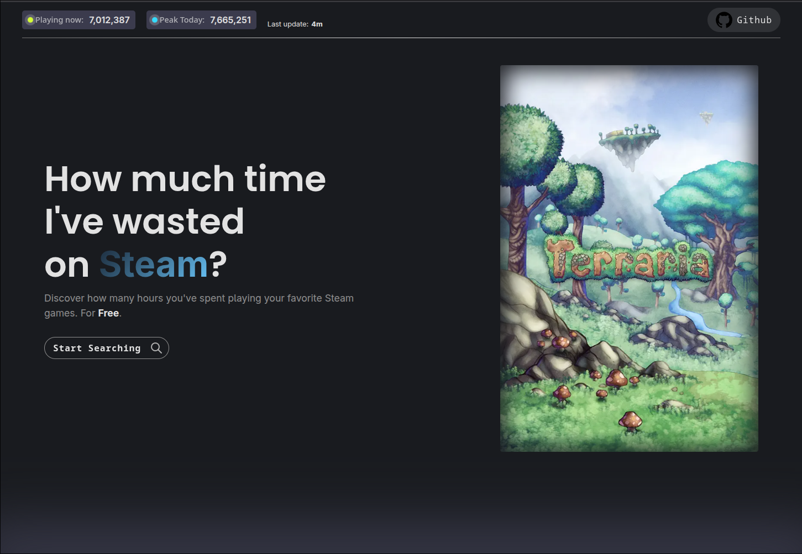

> [!WARNING]  
> Not even near to be finished. I have no idea if im coming back to this project anytime. I got focused more on the code logic's rather than design.

### What went wrong:

- steam api blocks me for 2hs after making 3 reqs at the same time
- steam api docs are the most undocumented thing in the universe
- im not going to do backend + frontend anymore. its just tedious.
- insanely boring

### what i've used

- Front (ts):

  - D3.js (new)
  - Angular
  - css (no tailwind)

- Back (go):

  - idk

- Extras:

  <!-- - Testing (new)
  - Docker (new)
  - Deploy (new)
  - GitHub Actions (? new) -->

  - Graphql (new)
